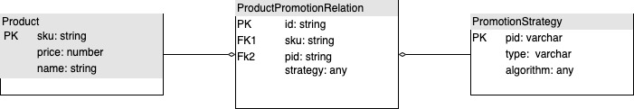
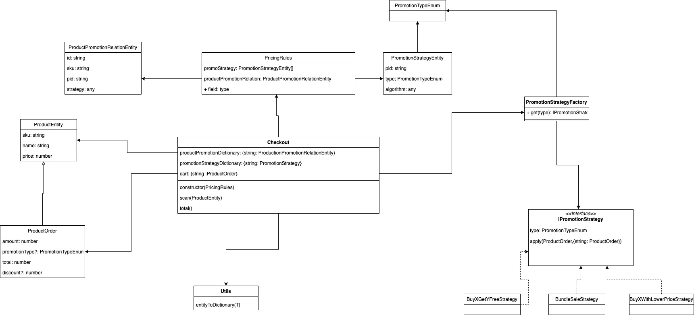

# Shopping Promotion
***
## Document purpose

The purpose of the readme are:

* To give a guideline of setup and running the given example
* To give a quick overview of the high-level design
* To guide user to scale the promotion strategy 

***
## Tech-Stack & Environment
* ES 2016+ / TypeScript 4+
* NodeJS
* Jest (Test Framework)

```javascript
> nvm install --lts
> npm ci
> npm test
```
***
## High level design
UML high level design
* Entity Relationship Diagram 
* Class Diagram 
***
## Database Entities 
### product

| Key Type | Columns | Type | Unique | Description |
| ---| --- | --- |  --- | --- |
| `PK` | `sku` | `sting` | `Y` |
|  | `name` | `sting` | `Y` |
|  | `price` | `number` | `Y` |

### product promotion relation
| Key Type | Columns | Type | Unique | Description |
| ---| --- | --- |  --- | --- |
| `PK` | `id` | `number` | `Y` | 
| `FK` | `sku` | `sting` |  | `foreign key of product table` |
| `FK` | `pid` | `string` |  | `foreign key of promotion strategy table` |
|  | `strategy` | `any` |  | `configuration used to decide how we run the promotion` |

### promotion strategy
| Key Type | Columns | Type | Unique | Description |
| ---| --- | --- |  --- | --- |
| `PK` | `id` | `string` | `Y` |
|  | `type` | `sting` |  | `map to stragey implementation in the code` |
|  | `algorithm` | `any` |  | `configurations used to work out the discount` |

***
## Flexibility and scalability
* To scale up the strategy, we would need to create the new strategy, update the available strategy enum and allow 
factory to return the strategy instance
* To apply the new strategy to the product, just insert a new record into the product promotion relation table to associate
the product and strategy
* To make the strategy reusable, the algorithm should be configurable from promotion strategy table
* To support the promotion availability control, strategy in product promotion can be used for the rules configuration and handle programtically